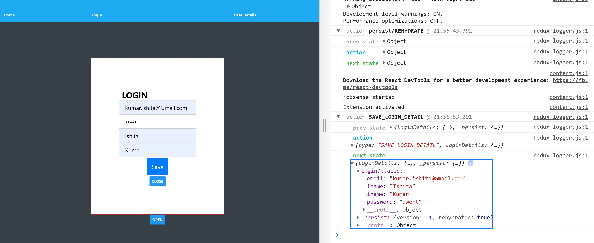
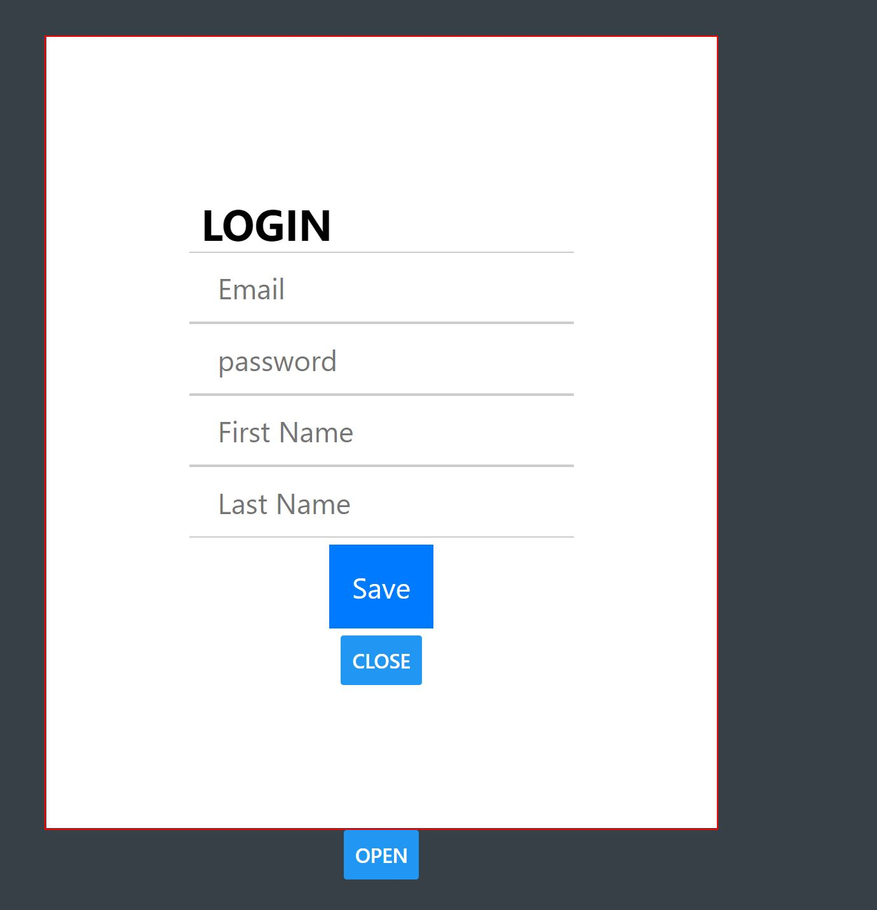
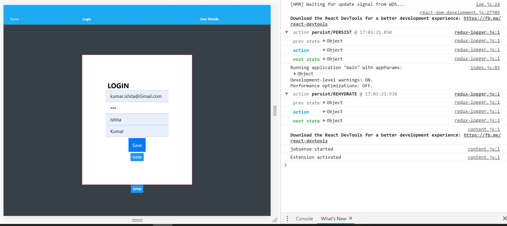
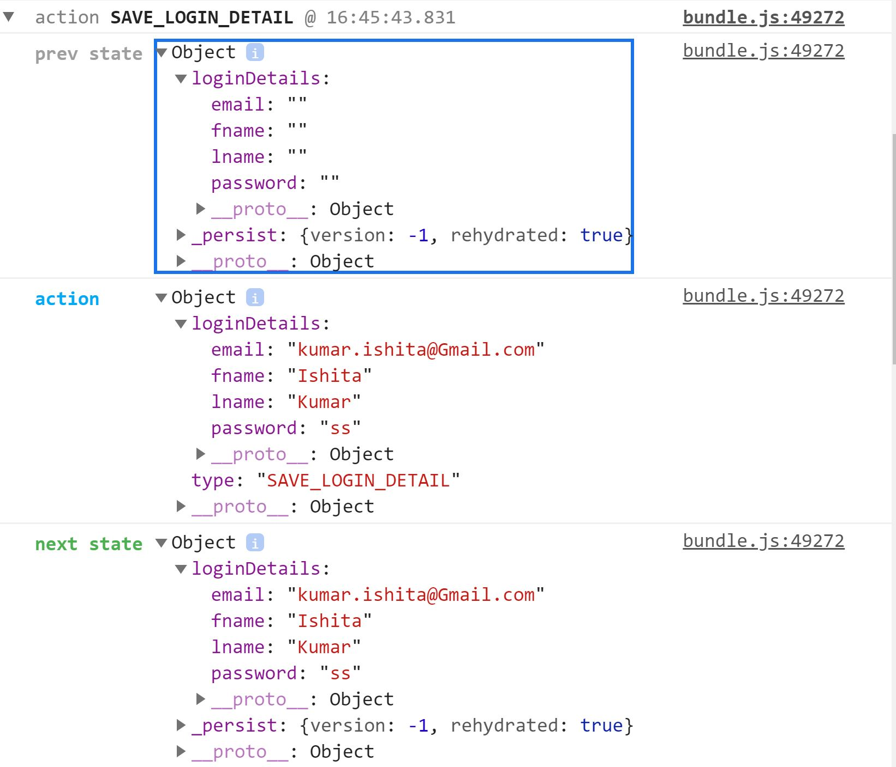

# PervasiveComputing_ReactNative
## Assignment 7  Description

Task 1:  Image picker API on login page to pick an image from gallery or take a phone

Task 2: Used Expo Notifications to send user a notification 

Task 3: Built using expo API Expourl: https://expo.io/@ishkumar96/projects/labproject

## Screenshots 

The video of the above tasks are : 

## Assignment 6  Description

Demo and create an animation on the home page using any of the Animated API or Animatable API for image or card and handle the gestures on this animation using PanResponder. 

The gesture is to be handled by doing an action like changing the states thorugh props or navigating to another window on the user gesture inside the panresponder create function.

## Implementation 
For this, we use a tinder like swipe idea using Animated API, PanResponder and Cards. 
Code inspired by this [link](https://code.likeagirl.io/creating-tinder-like-swipe-component-with-react-native-3bf15e6be7e3)

## Screenshots 
This video shows the use of ANIMATED API  on the app.

   

## Assignment 5 Description

Demo the use of redux-persist for the login/sign up module.

Demo use of alerts in your app for confirmation of user action.

## Implementation 
We use redux persist to store the state of our object in local storage. 

## Screenshots 
This video shows the use of persist and alerts on the app.

Thsi screenshot shows that after refresh the nextstate is stored in the app.

   
## Assignment 4 Description

This assignment includes the following: 
Understand and demonstrate the use of Redux as a state management tool for the login/sign up module.
Console log or display the the results of state change on your web page.

## Implementation 
Redux is state management tool. With the help of Redux, all state in your application are kept in store and that can be accessible from all components.

The new folders added are : 
Actions
Reducers
Store 
mapDispatchToProps adds redux to our login.js page
In debugger, you can see prev state, action & next state with updated values.
We cal the reduxSaveloginDetail action onClick of submit button.

## Screenshots 
### The basic Login Page

### Filling in details

### Login Modal Console data

    
## Assignment 3 Description

This assignment includes the following: 
A sign up module with essentials fields like email, password, name, etc using modals
A user details form to receive input such as birthdate (use date picker widget), country,  gender (use picker widget), biography

## Screenshots 
### The basic App

### Login Modal

### Login Modal Console data

### User Details Modal

### User Details Modal  Console data

<!-- assets\screenshot_assignment2.JPG -->
