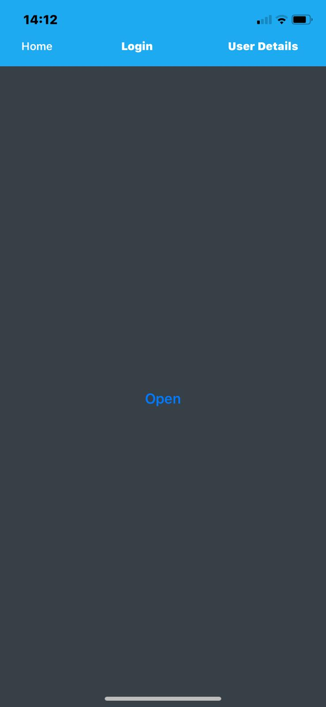
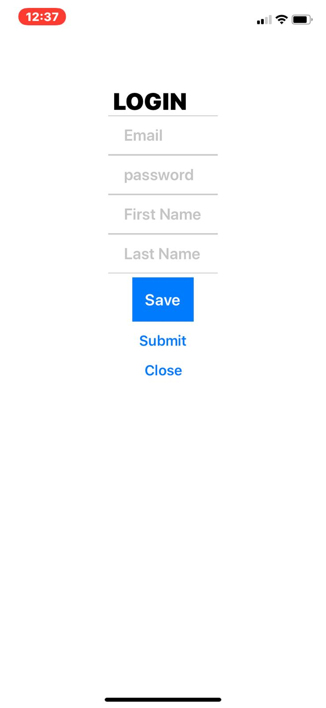
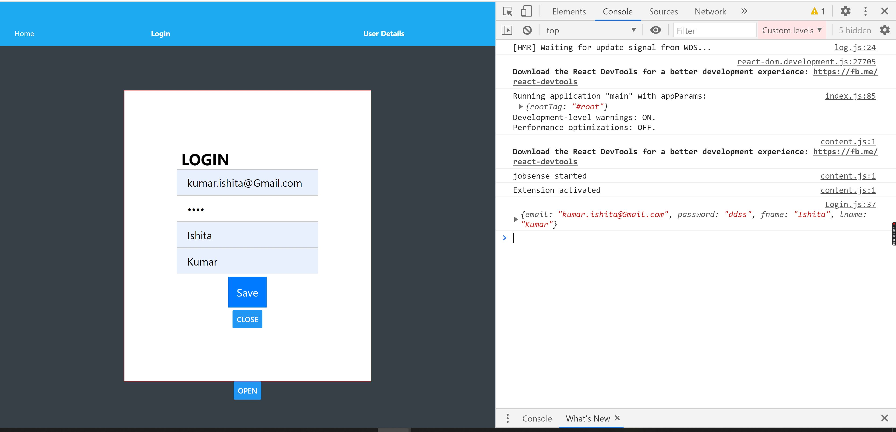
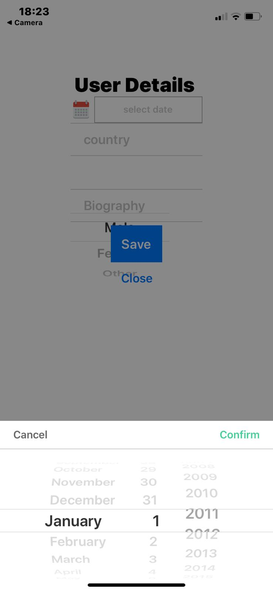
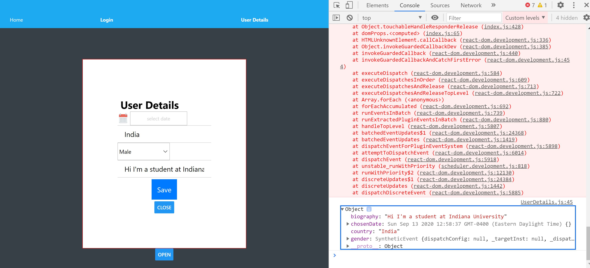

# PervasiveComputing_ReactNative

    
## Assignment Description

This assignment includes the following: 
A sign up module with essentials fields like email, password, name, etc using modals
A user details form to receive input such as birthdate (use date picker widget), country,  gender (use picker widget), biography

## Screenshots 
### The basic App

### Login Modal

### Login Modal Console data

### User Details Modal

### User Details Modal  Console data

<!-- assets\screenshot_assignment2.JPG -->